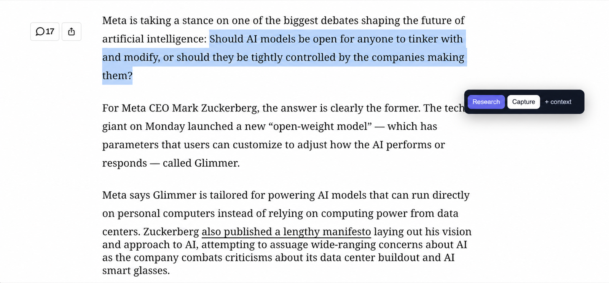
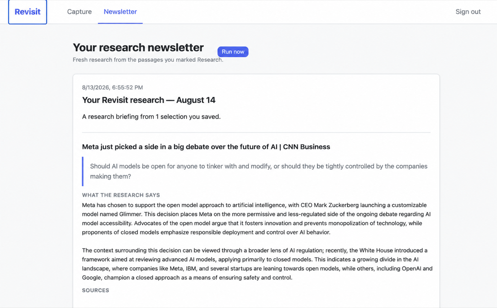
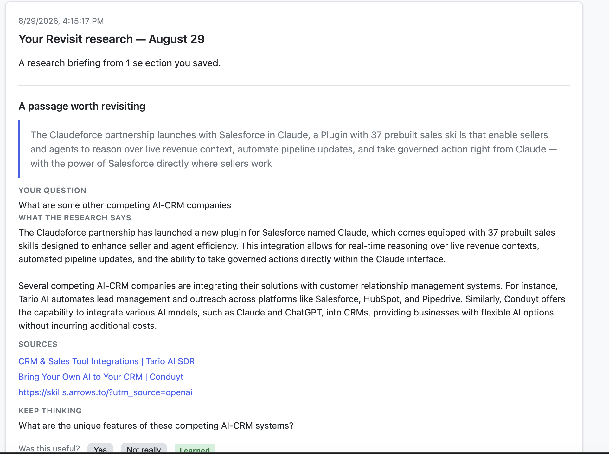

<div align="center">

# Revisit

### Turn the passages you save into research worth returning to.

Revisit is a Chrome research companion that captures selected text in one click and turns your questions into a focused, sourced newsletter.

**Private beta · Chrome extension + web app**

[Join the beta waitlist](https://github.com/JyotBuch/Revisit/issues/new?template=beta-interest.yml) · [How it works](#how-it-works) · [Run locally](#run-locally)

</div>

<p align="center">
  
</p>

<p align="center"><em>Select a passage and decide whether to research it or simply keep it. Beta interface shown.</em></p>

## See Revisit in action

<p align="center">
  <a href="docs/videos/revisit.mp4">
    
  </a>
</p>

<p align="center"><strong><a href="docs/videos/revisit.mp4">Watch the 43-second product demo →</a></strong></p>

<p align="center"><em>See the beta workflow from selecting a passage through generating its research newsletter.</em></p>

## Save less. Learn more.

Bookmarks are easy to collect and hard to revisit. Revisit preserves the exact idea that caught your attention, along with the page it came from, and gives you a deliberate next step.

- **Research** saves the passage and includes it in your next research briefing.
- **Capture** keeps the passage in your library without researching it.
- **+ context** adds an optional question or angle, such as “What have other AI leaders said about this?”

The passage, URL, page title, domain, author, description, and capture time are recorded automatically. Nothing is saved until you click **Research** or **Capture**.

## How it works

1. **Select something worth keeping.** Highlight text on a webpage and the Revisit actions appear beside it.
2. **Choose the intent.** Research it, capture it for later, or add a question to guide the research.
3. **Read the briefing.** Run research on demand and Revisit produces a dated newsletter with your original passage, a focused synthesis, related sources, and a question to keep thinking.

## From a passage to a briefing

<p align="center">
  
</p>

<p align="center"><em>Your saved passage stays visible alongside the resulting research and sources. Beta interface shown.</em></p>

<p align="center">
  
</p>

<p align="center"><em>Ask a focused question and get a sourced briefing with a useful next question.</em></p>

## What the beta includes

- A Manifest V3 Chrome extension with an inline selection interface
- One-click Research and Capture modes
- Optional questions that guide search and synthesis
- Automatic source metadata collection
- Google sign-in and private, user-scoped captures
- On-demand research newsletters with related web sources
- A web library for reviewing and clearing captures
- Popup, context-menu, and keyboard capture fallbacks

## Current beta limits

Revisit is being validated as a focused capture-to-newsletter product. The current free test deployment processes newsletters on demand; automatic nightly delivery is not enabled. The extension is distributed as an unpacked beta rather than through the Chrome Web Store, and the free hosting configuration is not intended for important or long-lived data.

Clustering, embeddings, collaboration, billing, Firefox, and mobile clients are intentionally outside the current production path.

## Join the beta

Want to try Revisit or share the research workflow you wish existed?

**[Join the beta waitlist →](https://github.com/JyotBuch/Revisit/issues/new?template=beta-interest.yml)**

The waitlist uses a public GitHub issue. Please do not include private, confidential, or sensitive information.

---

## For developers

Revisit currently uses FastAPI and Jinja for the web app, PostgreSQL for persistence, a Manifest V3 Chrome extension for capture, and OpenAI web search and synthesis. The checked-in Render Blueprint provides a free testing deployment with inline research jobs.

### Run locally

**Prerequisites:** Docker and Python 3.11+

```bash
make db-up
make install
cp .env.example .env
make migrate
make dev
```

Open `http://127.0.0.1:8000`. Add `OPENAI_API_KEY` to `.env` to enable live search and research; see [the extension setup guide](extension/README.md) to load the Chrome extension locally.

### Tests

```bash
make db-test-setup
make test
```

Tests use a local PostgreSQL test database and do not require live provider keys.

### Deployment and technical reference

- [`render.yaml`](render.yaml) documents the free Render testing deployment and required environment variables.
- [`FUNCTIONALITY.md`](FUNCTIONALITY.md) contains the detailed architecture and legacy pipeline reference.
- [`PRIVACY.md`](PRIVACY.md) contains the beta privacy notice.
- [`extension/README.md`](extension/README.md) covers Chrome OAuth and extension packaging.

### Adding README media

Place product screenshots in `docs/images/`, use lowercase descriptive filenames, and optimize them before committing. Reference them with repository-relative paths so they render both locally and on GitHub:

```markdown

```

Place short product videos in `docs/videos/` and link to them from a screenshot or descriptive text. Avoid absolute paths, personal information, credentials, and unnecessarily large media files.
